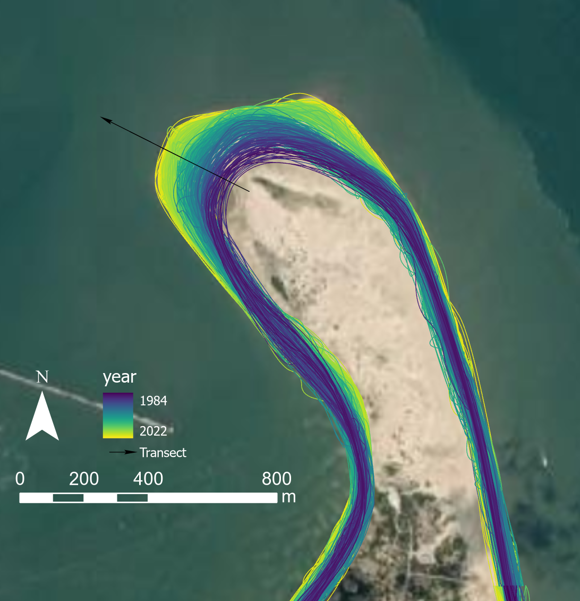

# Shoreline_Extraction_GAN

A work in progess in its beginning stages...more code and detail to come.

Generating binary land vs. water masks from coastal RGB imagery using [pix2pix](https://github.com/junyanz/pytorch-CycleGAN-and-pix2pix) and [cycle-GAN](https://github.com/junyanz/pytorch-CycleGAN-and-pix2pix).

This repo will (eventually) contain the following:
1. Code to help with setting up the training data for either of these image-to-image translation GANs.
2. Code to train both models.
3. Code to run the models.
4. Code to process the results and extract shorelines into GIS format.
5. Code to generate cross-shore transects and shoreline change timeseries (along with running means, linear trends, power spectra, NAO index).
6. Trained models for Delmarva, Jersey Shore, Long Island, and North Tuscany (Italy).
7. Code to download new imagery to run the model on.
8. Code to train and run LSTM models for shoreline projection.
9. Possible integration of NOAA wave buoy data and/or WaveWatch3 data (pending).

# Extraction Model Flow Diagram

Input: 256x256 RGB coastal satellite imagery is the input data.

1. These images get segmented into land and water binary images by the GAN (which consists of a 256x256 U-Net for the generator and a Patch-GAN for the discriminator, pix2pix-style).
2. Marching squares contouring algorithm is then used to delineated the land/water boundary.
3. The vector outputs from marching squares are then smoothed out using Chaikin's corner cutting algorithm.
4. Filters:
	* Recursive 3-sigma vertex filter: discard all shorelines that have mean vertices +/- 3*sigma vertices until no more shorelines can be discarded.
	* Reference shoreline filter (and buffer radius), all features that lie outside of the buffer radius of the reference shoreline are discarded.
	* Reference region filter, all shorelines that are not contained within the reference region are discarded.

Output: Timestamped vector shorelines

# Current Shoreline Extraction Training Data Domain

Training data outlined in black in each image. 

# GAN Dice Scores

Quantifying the segmentation accuracy over training epochs. Perfect segmentation would be a Dice Score of 1.0.

Final model run on the test dataset.

# Shoreline Extraction Deviation from Manual Delineation

How does the model extracted shorelines compare (in terms of meters) to manually delineated shorelines?

Final model run on the test dataset.

Median deviation is around 16 m. Likely is lower for Sentinel-2 imagery (10-m resolution) and higher for Landsat 5, 7, and 8 (30-m resolution).
Model performs worse on noisy/cloudy imagery.

# Test Dataset Examples

# Anaconda Environment Setup

envs/ holds three environment files that list all of the requirements.

pix2pix_shoreline is used for running the GANs, shoreline_prediction is for training/running LSTMS, while shoreline_gan is for everything else.

Use Anaconda to set these up.
    
    conda env create --file envs/pix2pix_shoreline.yml
    conda env create --file envs/shoreline_prediction.yml
    conda env create --file envs/shoreline_gan.yml

# Start Up

shoreline_gan_gui.py contains a gui for running this project.

After the two necessary Anaconda environments have been created, activate the shoreline_gan environment.

    conda activate shoreline_gan
    
Next, run the GUI Python file. Make sure you are sitting in the .../Shoreline_Extraction_GAN/ directory.

    python shoreline_gan_gui.py

The GUI should look like this, with eight separate buttons for various tasks related to shoreline extraction.

# Downloading satellite data

Click on 1. Download Imagery.

Data is downloaded using [CoastSat](https://github.com/kvos/CoastSat).

CoastSat allows users to download Landsat 5, 7, 8 and Sentinel-2 imagery from anywhere around the world.

CoastSat also includes a number of useful preprocessing tools.

To download satellite data, find an area where there are beaches and design a rectangular-shaped, north-up oriented, UTM aligned box.

If your area of interest is not rectangular and UTM-aligned, the Landsat images will have cropped out sections and lots of no-data areas.

The cloud-cover threshold is set to 0.30 in this code. 
You can change this in the file utils/download_utils, under the download_imagery function.

Pick a site name and enter this in the name text box.

Select a range of dates and enter these in the start and end date text boxes. 

You will need the corner coordinates to download imagery:

* (upper left longitude, upper left latitude)

* (upper right longitude, upper right latitude)

* (lower right longitude, lower right latitude)

* (lower left longitude, lower left latitude)

Then select which satellites you would like to pull imagery from (L5, L7, L8, and/or S2).

Once everything is ready, hit Start Download. This will make a new folder data/sitename where images get saved.

The metadata for all of the images are saved to a csv in this folder.

# Preprocessing for pix2pix

Before running pix2pix, the images need to be split and resized into 256 x 256.

Hit Preprocess Images. This will ask for a directory with the satellite jpegs.
This should be under data/sitename/jpg_files/preprocessed.

It will save the pix2pix ready images (each image gets split into a 'one' and 'two' image) to data/sitename/jpg_files/pix2pix_ready.

# Shoreline_Extraction

Hit Shoreline Extraction.

The current trained model is called shoreline_gan_july2. It should live under pix2pix_modules/checkpoints/shoreline_gan_july2.
Type this in the Model Name text box.

Next type in your site name.

Next, type in latest under the Epoch text box.

Specify a clip length. This is done to account for edge effects where the extracted shoreline often trails off.

Optionally, you can add a reference shoreline which is used to filter out erroneous results. Specify a buffer radius around the reference shoreline for this filter.

Also, optionally, you can add a reference region to filter out erroneous results. This will filter out all shorelines not completely contained in the region you provide.

Next, hit Run and Process. First, point it to data/sitename/jpg_files/pix2pix_ready.
Then point it to the metadata csv in data/sitename.

It will make two new directories: model_outputs/gan/sitename and model_outputs/processed/sitename.
The gan directory will have the GAN generated images.
The processed directory will have four subdirectories: kml_merged, shapefile_merged, shapefiles, and shoreline_images.

kml_merged/ will contain all extracted shorelines in two separate kmls for each side of the split images.

shapefile_merged/ will contain the following shapefiles:

If you provide both a reference shoreline and a reference region:

* sitenameone.shp and sitenametwo.shp, these are the unfiltered and smooth extracted shorelines
* sitenameone_ref_shoreline_filter.shp and sitenametwo_ref_shoreline_filter.shp, these are the shorelines filtered by the reference shoreline
* sitenameone_ref_region_filter.shp and sitenametwo_ref_region_filter.shp, these are the shorelines filtered by the reference region
* sitenameone_ref_region_filter_vtx.shp and sitenametwo_ref_region_filter_vtx.shp, these are the shorelines after the 3-sigma vertex filter

If you only provide a reference region, you will have:

* sitenameone.shp and sitenametwo.shp, these are the unfiltered and smooth extracted shorelines
* sitenameone_ref_region_filter.shp and sitenametwo_ref_region_filter.shp, these are the shorelines filtered by the reference region
* sitenameone_ref_region_filter_vtx.shp and sitenametwo_ref_region_filter_vtx.shp, these are the shorelines after the 3-sigma vertex filter

If you only provide a reference shoreline, you will have: 

* sitenameone.shp and sitenametwo.shp, these are the unfiltered and smooth extracted shorelines
* sitenameone_ref_shoreline_filter.shp and sitenametwo_ref_shoreline_filter.shp, these are the shorelines filtered by the reference shoreline
* sitenameone_ref_shoreline_filter_vtx.shp and sitenametwo_ref_shoreline_filter_vtx.shp, these are the shorelines after the 3-sigma vertex filter

If you don't provide a reference shoreline or a reference region:

* sitenameone.shp and sitenametwo.shp, these are the unfiltered and smooth extracted shorelines
* sitenameone_vtx.shp and sitenametwo__vtx.shp, these are the shorelines after the 3-sigma vertex filter

The shapefiles with the vtx filter will provide the best results. Using a reference shoreline or a reference region will greatly limit any additional editing in GIS software.

shapefiles/ will contain individual shoreline shapefiles for each image.

shoreline_images/ will contain RGB images with the extracted shorelines.

# Make Transects

Hit Make Transects.

You need a shapefile containing a reference shoreline to do this. 
Look in shoreline_images/ for a good example, and then find the corresponding shapefile in shapefiles/
Copy this file and put it in its own folder.

Select an alongshore spacing between transects, and a cross-shore length. 
The cross-shore length should be long enough to intersect all extracted shorelines at each transect.

Hit Select Reference Shoreline Shapefile, and point it to your reference shoreline. 
It will save the transects output to the same directory of the reference shoreline.

Check that the transects look correct in GIS software.

# Make Timeseries

Hit Make Timeseries.

Type in your site name. If your transects were oriented in the opposite direction of the ocean/sea/lake, check switch transect direction.

Next, hit Create Timeseries. This will ask for the shapefile containing all of the shorelines.

Next, it will ask for your transect shapefile.

Next, you need to tell it where to save the timeseries data.
 
Best to make a new directory to save this stuff to:

* Raw timeseries data (datetime, northings, eastings, cross-shore distance)
* Raw timeseries figure
* Raw timeseries with yearly linear trend figure
* 3-month, 6-month, and yearly running means with linear trend figure
* Power spectrum figure
* 3-month running mean with NAO figure
* De-trended timeseries figure
* Yearly trend data (datetime, predicted cross-shore distance, residual)

This tool will also make a new transects shapefile with the yearly trend values added as a field.
This file will be saved in the same directory as the original transect shapefile.

# Project Timeseries

Hit Project Timeseries

Using LSTMs to project cross-shore positions into the future. 

To use this tool, you should have a folder with all of the cross-shore timeseries for your study areas (defined by a transect number).

You will need to input the following:

* a site name
* a starting and ending index (transect number to start and stop at)
* the number of epochs to train each LSTM for
* the batch size for training the LSTM
* the number of layers in the LSTM
* the look-back value for the LSTM
* the number of predictions, 
* the number of times to repeat training to get a confidence interval for the projections
* the training data split fraction 

The default values have so far been promising, but will depend upon the different datasets used. 

Fine-tuning of various values (epochs, batch size, layers, look-back values, predictions, repeats) 
would be beneficial to get the best results. 

Currently, the LSTM is trained to project shorelines at 3-month intervals, so with a number of 
predicitons equal to 40, it is projecting ten years from the last observed satellite shoreline (4 predictions per year, 40 predictions per ten years).

Upon clicking Run, you will need to feed it the folder with the extracted timeseries, and then make a new folder to save the projections to.

For each transect it will save to the projected folder:

* CSV containing projected values (datetime, mean projected cross-shore distance, upper 95% confidence bound, lower 95% confidence bound)
* Timeseries figure with the 3-month moving average and then the projected data

# Merge Projections

Hit Merge Projections

This function will merge the timeseries projections into 2D shorelines and 95% confidence polygons for each projected time.

Input the following:

* the site name
* start transect index
* end transect index
* the EPSG code for the coordinate system used (whatever EPSG code that corresponds to the study area's WGS84/UTM zone)
* whether or not the transects are running in the opposite direction of the water and need to be flipped.

Upon clicking Run, you will need to feed it the folder holding the extracted timeseries, 
then the folder holding the projected timeseries, and then the shapefile holding the transects.

It will save the two shapefiles (projected shorelines and projected confidence intervals) into the projected timeseries folder. 
It will also add northings and eastings as columns to each
projected timeseries csv.

# Retraining Model

It is very possible that the area you are testing the model contains completely novel data for the GAN.
This might make the results quite bad. To get better results, you need to train the GAN on annotations from the new study area.

I will add more details on how to set up a training dataset in the future.

Click Retraining Model.

Once the training dataset is set up, type in the model name. It is probably best to use the default epochs and decay epochs.
If you are continuing training from existing checkpoints, hit the continuing training check box, and specify the starting epoch.
Then hit Run.

