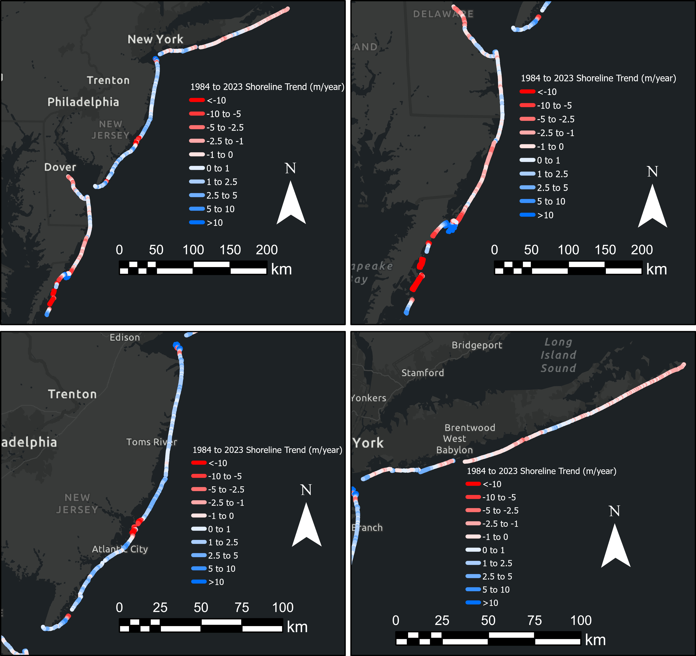
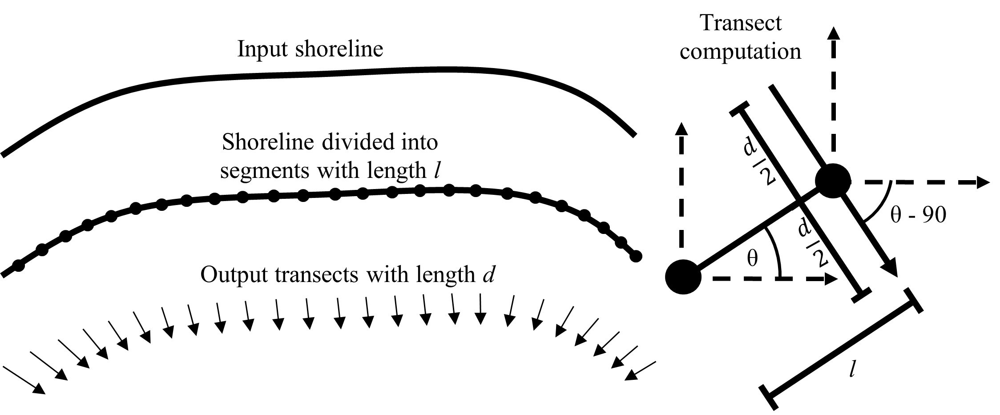
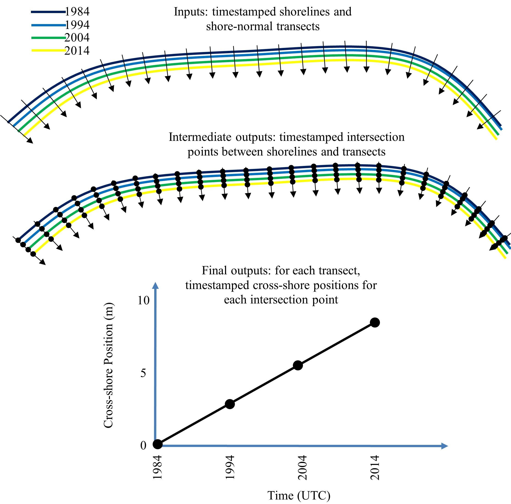

# Shoreline_Extraction_GAN

Author: Mark Lundine, PhD Candidate, University of Delaware, mlundine@udel.edu

# Some Cool Examples

Delmarva, New Jersey Shore, Long Island, USA

* A mix of estuarine beaches, developed and undeveloped ocean-fronting barrier island beaches on a passive margin

Delmarva

* Top Left: Broadkill Beach
* Top Right: Cape Henlopen
* Bottom Right: Ocean City and Assateague
* Bottom Left: Fishing Point and Wallops Island

Jersey Shore

* Top Left: Sandy Hook
* Top Right: Brigantine
* Bottom Right: Beach Haven
* Bottom Left: Ocean City

Long Island

* Top Left: Montauk
* Top Right: Northeastern Fire Island
* Bottom Right: Jones Beach
* Bottom Left: Rockaway

Northern Tuscany, Italy:

* A litorral cell with highly developed and modified beaches on the Mediterranean Sea
* Bound by the rocky headlands on the northern and southern ends
* Fed sediment by the Magra river from the north and the Arno River from the south
* Top Left: Entire Cell
* Top Right: Parco Regionale Migliarino
* Bottom Right: Forte dei Marmi
* Bottom Left: Viareggio

LSTM Example Outputs from Cape Henlopen

# Synopsis

Data-driven satellite shoreline analysis with GANs and LSTMs. 

How can we use satellite imagery to quantify historical patterns in sandy beach dynamics?

* Need a model that can delineate the land/water boundary in satellite imagery.
* Need some tools that can automate cross-shore position timeseries generation from shoreline data.

How can we use data to predict future sandy beach dynamics?

* Experiment with long short-term memory networks, models that aim to predict the future value of a timeseries based on previous values.

# Extraction Model Flow Diagram

Input: 256x256 RGB coastal satellite imagery is the input data.

1. These images get segmented into land and water binary images by the GAN (which consists of a 256x256 U-Net for the generator and a Patch-GAN for the discriminator, pix2pix-style).
2. Marching squares contouring algorithm is then used to delineate the land/water boundary.

3. The vector outputs from marching squares are then smoothed out using Chaikin's corner cutting algorithm (five refinements).

4. Filters:
	* Recursive 3-sigma vertex filter: discard all shorelines that have mean vertices +/- 3*sigma vertices until no more shorelines can be discarded.
	* Reference shoreline filter (and buffer radius), all features that lie outside of the buffer radius of the reference shoreline are discarded.
	* Reference region filter, all shorelines that are not contained within the reference region are discarded.

Output: Timestamped vector shorelines

# Current Shoreline Extraction Training Data Domain

Training data outlined in black in each image. Annotation pairs consist of an RGB image and a segmented land/water binary image.

Currently, training data encompasses Delmarva, New Jersey Shore, and Long Island (all USA), as well as a section of coast in northern Tuscany, Italy.

I aimed to cover most of the mid-Atlantic and then added the Tuscany section during my time working at the University of Pisa in Pisa, Italy.

Viriginia Beach and the Outer Banks of North Carolina will be added to the model training data domain later this spring.

Great Lakes data will be added hopefully this summer.

If you have any training data I could use (and possibly in-situ comparison data), feel free to reach out (mlundine@udel.edu).

Augmentations can help increase the variability in the annotation dataset.
Augmentations included vertical flip, horizontal flip, 90 degree CW rotation, 90 degree CCW rotation, and combined vertical and horizontal flip.
These augmentations were chosen to show the model more spatial configurations of beaches.

Total set of labeled images was 128,012. Split was 80% training, 10% validation, and 10% testing.
* Training images are used to calculate training loss throughout training. 
  During model training, the aim is to update the model's parameters to minimize the training loss.
* Validation images are used to independently assess the model's error throughout the training procedure. 
  These are not shown to the model during training nor are they used to update model weights.
* Testing images are used to indepently assess the final chosen model. 
  These are not shown to the model during training nor are they used to update model weights.

# GAN Training Details

* Generator: 256x256 U-Net
* Discriminator: PatchGAN
* GPU: NVIDIA GeForce GTX 1650 (4GB memory)
* Learning Rate: 0.000002 for first 10 epochs, linearly decay to zero final five epochs.
* Optimizer: Adam
* Loss functions 
	* Generator: 
		* a binary cross entropy loss of the generated images and an array of ones
		* a L1 loss between the generated and target image
	* Discriminator:
		* the “real” loss which is a binary cross entropy loss between the target images and an array of ones
		* the “fake” loss which is a binary cross entropy loss between the generated images and an array of zeros

# GAN Dice Scores

Quantifying the segmentation accuracy over training epochs. Perfect segmentation would be a Dice Score of 1.0.

Final model run on the test dataset.

# Test Dataset Examples

# Manually Delineated Vs. Shoreline Extraction Model

This is showing how the deviation in shoreline position between the extracted shorelines 
and manually delineated shorelines improves through model training on both the training and validation images.

This is a box plot of the deviations for the testing images, with shorelines extracted with the final model (epoch 15).

Here is how the deviations compare from the four separate satellites in box plot form. 
Landsat 7 has greater variance mainly due to artifacts in Landsat 7 imagery due to the scan-line corrector failure in 2003.

Here is how the deviations differ over separate decades in box plot form. We can see greater variance in the 2000s likely again due to the Landsat 7 issues.

Here is how the deviations differ each year in box plot form.

And last here are the median deviations each year as a timeseries.

The deviations are fairly consistent across the available temporal range, meaning the model is providing consistent results no matter the year.
Larger deviations, and hence poor automated delineation of shorelines, is likely occuring in cloudy and noisy images.

# Setup

Tutorial Videos
*  [1. Downloading Anaconda](https://drive.google.com/file/d/1mo3qzJwXKc3jsPAT3bEwZMjwo4qby4u3/view?usp=sharing)
*  [2. Repository Download](https://drive.google.com/file/d/1ESlgUuEczr4HWxeW5sYcanG-Dumb0Vkh/view?usp=sharing)
*  [3. Setting Up Anaconda Environments](https://drive.google.com/file/d/1gDhRgwrC53VqtSo9KDsyUXcAEl4hGO4t/view?usp=sharing)
*  [4. Checking Anaconda Environment Setup](https://drive.google.com/file/d/1xXtTi_VmDIS9Vcyj7bvUQQhlf6z2MAL_/view?usp=sharing)

You will need a Windows PC, an NVIDIA graphics card, and Anaconda to run this software.

Anaconda can be downloaded [here](https://www.anaconda.com/products/distribution).

Download the source code, latest_net_G.pth, and latest_net_D.pth from the latest [Release](https://github.com/mlundine/Shoreline_Extraction_GAN/releases).

Unzip the source code somewhere on your machine and remove the version tag from the outermost directory so that it reads "Shoreline_Extraction_GAN".

Make a new directory in .../Shoreline_Extraction_GAN/pix2pix_modules/ called "checkpoints".

Make a new directory in .../Shoreline_Extraction_GAN/pix2pix_modules/checkpoints called "shoreline_gan_nov".

Place latest_net_G.pth and latest_net_D.pth in .../Shoreline_Extraction_GAN/pix2pix_modules/checkpoints/shoreline_gan_nov.

envs/ holds three environment files that list all of the requirements.

pix2pix_shoreline is used for running the GANs, shoreline_prediction is for training/running LSTMS, while shoreline_gan is for everything else.

Use Anaconda to set these up.
    
    conda env create --file envs/pix2pix_shoreline.yml
    conda env create --file envs/shoreline_prediction.yml
    conda env create --file envs/shoreline_gan.yml

# Start Up

Tutorial Video
*  [5. GUI Start Up](https://drive.google.com/file/d/1nfKQxZ1qA2yMjGDxL8sOJKHhf_8DZ9bL/view?usp=sharing)

shoreline_gan_gui.py contains a gui for running this project.

After the three necessary Anaconda environments have been created, activate the shoreline_gan environment.

    conda activate shoreline_gan
    
Next, run the GUI Python file. Make sure you are sitting in the .../Shoreline_Extraction_GAN/ directory.

    python shoreline_gan_gui.py

The GUI should look like this, with eight separate buttons for various tasks related to shoreline extraction.

# Downloading satellite data

Tutorial Video
*  [6. Downloading Imagery](https://drive.google.com/file/d/19DpOH9qtnXP_5VgdBC2MF_qP4AKo7Cj-/view?usp=sharing)

Click on 1. Download Imagery.

Data is downloaded using [CoastSat](https://github.com/kvos/CoastSat).

CoastSat allows users to download Landsat 5, 7, 8 and Sentinel-2 imagery from anywhere around the world.

CoastSat also includes a number of useful preprocessing tools.

To download satellite data, find an area where there are beaches and design a rectangular-shaped, north-up oriented, UTM aligned box.

If your area of interest is not rectangular and UTM-aligned, the Landsat images will have cropped out sections and lots of no-data areas.

The cloud-cover threshold is set to 0.30 in this code. 
You can change this in the file utils/download_utils, under the download_imagery function.

Pick a site name and enter this in the name text box.

Select a range of dates and enter these in the start and end date text boxes. 

You will need the corner coordinates to download imagery:

* (upper left longitude, upper left latitude)

* (upper right longitude, upper right latitude)

* (lower right longitude, lower right latitude)

* (lower left longitude, lower left latitude)

Then select which satellites you would like to pull imagery from (L5, L7, L8, and/or S2).

Once everything is ready, hit Start Download. This will make a new folder data/sitename where images get saved.
The metadata for all of the images are saved to a csv in this folder.

Optionally, you can choose a shapefile with already constructed study areas. This is useful if you wish to download imagery from many study areas.
* If you are doing the shapefile download, make sure this option is checked. 
* Fill in the dates, the satellite choices, and put in a base site name.
  Each study area will have a number appended to the given base site name (Delaware1, Delaware2, Delaware3, etc).
* Give the starting and ending index of the features in the shapefile you want to use (ex: first five study areas would be starting index 1 and ending index 5).
* You can leave the coordinates blank.
* Hit Start Download, and then point it towards the shapefile containing your study areas.

# Preprocessing for pix2pix

Tutorial Video
* [7. Preprocessing Images](https://drive.google.com/file/d/1xBZ1kAiYIvqtHaFTX8SpFo7aJ7PHL2fC/view?usp=sharing)

Before running pix2pix, the images need to be split and resized into 256 x 256.

Hit Preprocess Images. This will ask for a directory with the satellite jpegs.
This should be under data/sitename/jpg_files/preprocessed.

It will save the pix2pix ready images (each image gets split into a 'one' and 'two' image) to data/sitename/jpg_files/pix2pix_ready.

# Shoreline_Extraction

Tutorial Video
*  [8. Shoreline Extraction](https://drive.google.com/file/d/1ub8m2Awa18I-Sj4vQ0huMapZiCOu3Ymo/view?usp=sharing)

Hit Shoreline Extraction.

* The current trained models are under Releases. Make a folder in .../Shoreline_Extraction_GAN/pix2pix_modules/checkpoints called shoreline_gan_nov. Place both latest_net_G.pth and latest_net_D.pth in the shoreline_gan_nov folder.

* Type shoreline_gan_nov in the Model Name text box.

* Next type in your site name.

* Next, type in latest under the Epoch text box.

* Specify a clip length. This is done to account for edge effects where the extracted shoreline often trails off.

* Optionally, you can add a reference shoreline which is used to filter out erroneous results. Specify a buffer radius around the reference shoreline for this filter.

* Also, optionally, you can add a reference region to filter out erroneous results. This will filter out all shorelines not completely contained in the region you provide.

* Next, hit Run and Process. First, point it to data/sitename/jpg_files/pix2pix_ready. Then point it to the metadata csv in data/sitename.

* It will make two new directories: model_outputs/gan/sitename and model_outputs/processed/sitename.
	* The gan directory will have the GAN generated images.
	* The processed directory will have four subdirectories: kml_merged, shapefile_merged, shapefiles, and shoreline_images.
		* kml_merged/ will contain all extracted shorelines in two separate kmls for each side of the split images.
		* shoreline_images/ will contain RGB images with the extracted shorelines.
		* shapefiles/ will contain individual shoreline shapefiles for each image.
		* shapefile_merged/ will contain the following shapefiles:
			* If you provide both a reference shoreline and a reference region:
				* sitenameone.shp and sitenametwo.shp, these are the unfiltered and smooth extracted shorelines
				* sitenameone_ref_shoreline_filter.shp and sitenametwo_ref_shoreline_filter.shp, these are the shorelines filtered by the reference shoreline
				* sitenameone_ref_region_filter.shp and sitenametwo_ref_region_filter.shp, these are the shorelines filtered by the reference region
				* sitenameone_ref_region_filter_vtx.shp and sitenametwo_ref_region_filter_vtx.shp, these are the shorelines after the 3-sigma vertex filter
			* If you only provide a reference region, you will have:
				* sitenameone.shp and sitenametwo.shp, these are the unfiltered and smooth extracted shorelines
				* sitenameone_ref_region_filter.shp and sitenametwo_ref_region_filter.shp, these are the shorelines filtered by the reference region
				* sitenameone_ref_region_filter_vtx.shp and sitenametwo_ref_region_filter_vtx.shp, these are the shorelines after the 3-sigma vertex filter
			* If you only provide a reference shoreline, you will have: 
				* sitenameone.shp and sitenametwo.shp, these are the unfiltered and smooth extracted shorelines
				* sitenameone_ref_shoreline_filter.shp and sitenametwo_ref_shoreline_filter.shp, these are the shorelines filtered by the reference shoreline
				* sitenameone_ref_shoreline_filter_vtx.shp and sitenametwo_ref_shoreline_filter_vtx.shp, these are the shorelines after the 3-sigma vertex filter
			* If you don't provide a reference shoreline or a reference region:
				* sitenameone.shp and sitenametwo.shp, these are the unfiltered and smooth extracted shorelines
				* sitenameone_vtx.shp and sitenametwo__vtx.shp, these are the shorelines after the 3-sigma vertex filter.
		
* The shapefiles with the vtx filter will provide the best results. Using a reference shoreline or a reference region will greatly limit any additional editing in GIS software.

# Make Transects

Tutorial Video
* [9. Making Transects](https://drive.google.com/file/d/1uSOG-kzbiFzqLFjWD2OZiadokWlId_UW/view?usp=sharing)

Hit Make Transects.

* You need a shapefile containing a reference shoreline to do this. 
  Look in shoreline_images/ for a good example, and then find the corresponding shapefile in shapefiles/
  Copy this file and put it in its own folder.

* Select an alongshore spacing between transects, and a cross-shore length. 
  The cross-shore length should be long enough to intersect all extracted shorelines at each transect.

* Hit Select Reference Shoreline Shapefile, and point it to your reference shoreline. 
  It will save the transects output to the same directory of the reference shoreline.

* Check that the transects look correct in GIS software.

# Make Timeseries

Tutorial Video
* [10. Making Timeseries](https://drive.google.com/file/d/1g5o1H1ZsgFL0_ie1D7uKoIRV3Ve89R6R/view?usp=sharing)

Hit Make Timeseries.

* Type in your site name. If your transects were oriented in the opposite direction of the ocean/sea/lake, check switch transect direction.

* Next, hit Create Timeseries. This will ask for the shapefile containing all of the shorelines.

* Next, it will ask for your transect shapefile.

* Next, you need to tell it where to save the timeseries data. Make a new folder for this.
	* Raw timeseries data (datetime, northings, eastings, cross-shore distance)
	* Raw timeseries figure
	* Raw timeseries with yearly linear trend figure
	* 3-month, 6-month, and yearly running means with linear trend figure
	* Power spectrum figure
	* 3-month running mean with NAO figure
	* De-trended timeseries figure
	* Yearly trend data (datetime, predicted cross-shore distance, residual)

* This tool will also make a new transects shapefile with the yearly trend values added as a field. 
* This file will be saved in the same directory as the original transect shapefile.

# Making Linear Trend Shapefile

Tutorial Video
*  [11. Making Linear Trend Shapefile](https://drive.google.com/file/d/1Bd9AIKezy-_wd26vdKE6dqSSlRTHjIAp/view?usp=sharing)

This tool allows for the construction of shapefiles that help with visualization of linear trends computed on each transect's cross-shore position timeseries.
Each transect will be re-scaled and the direction changed to correspond with the value of the computed linear trend.

Fit a linear model to this data using ordinary least squares (OLS)
* y_i = b + mx_i + e 
* b is the y-intercept (OLS estimated parameter)
* m is the slope of the line (in m/year) (OLS estimated parameter)
* x_i is the independent variable (years)
* y_i is the dependent variable (cross-shore distance)
* e is the model error (normally distributed, mean of zero)
* m gives us an estimate for yearly shoreline change, under the assumption that the shorelines are eroding or accreting at a constant linear rate

Making a map of shoreline change vectors
* Shoreline linear trend for the ith transect, s_i (m/year)
* Assume s_i is constant over time: ds/dt = 0
* Length of line on map, L_i (m)
* Pick a constant value, call it A, (units of years) to multiply all the slopes by
* L_i = A*s_i
	* y*m/y = m
* So on the map, each line in this case is projecting the estimated slope A years into the future
	* A = 100 years
		* 100m length means a projection of 100m of growth/retreat in 100 years
		* Direction towards land indicates retreat
		* Direction towards sea indicates growth

To use this tool, hit "Get Linear Trend Shapefile"

* This tool should be used after timeseries data has been generated
* You will need to enter the site name in the site name text box, followed by an underscore (ex: Delmarva_)
* Set a minimum and maximum year for the data
	* Only cross-shore positions within these years will be used for computing linear trends
* Type in the EPSG code for the transects shapefile
* Hit Make Linear Trends Shapefile
	* It will first ask for the transects shapefile you used to generate the timeseries data
	* Next it will ask for the folder where the timeseries data was saved to
	* It will save the new shapefile in the same folder as the transects shapefile you pointed it to, with the min/max years added to the name of the new file
	* You will need to edit the symbology of the shapefile to help with visualization (ex: making a graduated color scale for the linear trend values)

# Project Timeseries

Tutorial Videos
* [12. Projecting Timeseries a)](https://drive.google.com/file/d/1u2eZ6dROaYcF-vt_T2JV_90gZsU3g6cM/view?usp=sharing)
* [13. Projecting Timeseries b)](https://drive.google.com/file/d/1K3LL2_HvNrEgXIjUcMwqpadBCkcfwjVQ/view?usp=sharing)

Hit Project Timeseries

Using LSTMs to project cross-shore positions into the future for an entire section of the coast.
* LSTM Architecture
	* Training data: N cross-shore position timeseries
	* Two stacked, bidirectional LSTM layers.
	* Loss function: mean absolute error, keeps the units in meters
	* Early stopping for training (if validation loss does not improve for 100 epochs, halt training)
	* Repeat training a set number of times to get a distribution and confidence interval of model outputs
	* Dimensions of inputs and outputs for the model
		* Dependent upon the look-back value, L and the number of transects, N
		* Input: (L, N), or the previous L values for each transect
		* Ouput: (1, N), or the next value for each transect

* To use this tool, you should have a folder with all of the cross-shore timeseries for your study areas (defined by a transect number).

* You will need to input the following:
	* a site name
	* a starting and ending index (transect number to start and stop at)
	* the number of epochs to train each LSTM for
	* the batch size for training the LSTM
	* the number of units in the LSTM
	* the look-back value for the LSTM
	* the number of predictions, 
	* the number of times to repeat training to get a confidence interval for the projections
	* the training data split fraction 

* Values will vary depending upon input datasets. Fine-tuning of various values (epochs, batch size, layers, look-back values, predictions, repeats) would be beneficial to get the best results. 

* Currently, the LSTM is trained to project shorelines at 3-month intervals, so with a number of predicitons equal to 40, it is projecting ten years from the last observed satellite shoreline (4 predictions per year, 40 predictions per ten years).

* Upon clicking Run, you will need to feed it the folder with the extracted timeseries, and then make a new folder to save the projections to.

* For each transect it will save to the projected folder:
	* CSV containing predicted values (datetime, mean projected cross-shore distance, upper 95% confidence bound, lower 95% confidence bound)
	* Timeseries figure with the predicted and ground-truth values
	* CSV containing projected values (datetime, mean projected cross-shore distance, upper 95% confidence bound, lower 95% confidence bound)
	* Timeseries figure with the projected and ground-truth values

# Merge Projections

Tutorial Video
*  [14. Merging Projections](https://drive.google.com/file/d/1mKG4G_gLU7mjz79GFxuIuqPtDOS7K2gi/view?usp=share_link)

With timeseries of projected cross-shore positions, as well as the transects at which the timeseries data was originally extracted from,
we can re-cast these values into UTM coordinates with simple trigonmetry. 

Hit Merge Projections

* This function will merge the timeseries projections into 2D shorelines and 95% confidence polygons for each projected time.

* Input the following:
	* the site name
	* start transect index
	* end transect index
	* the EPSG code for the coordinate system used (whatever EPSG code that corresponds to the study area's WGS84/UTM zone)
	* whether or not the transects are running in the opposite direction of the water and need to be flipped.

* Upon clicking Run, you will need to feed it the folder holding the extracted timeseries, then the folder holding the projected timeseries, and then the shapefile holding the transects.

* It will save four shapefiles (predicted and projected shorelines, predicted and projected confidence intervals) into the projected timeseries folder. 
* It will also add northings and eastings as columns to each timeseries csv.

* Will not work if a shoreline has multiple solutions along one of the transects at a single time. 
Consequently, areas with extremely complex 2D longshore morphologies are not suitable for this type of modeling approach.

# Retraining Model

It is very possible that the area you are testing the model contains completely novel data for the GAN.
This might make the results quite bad. To get better results, you need to train the GAN on annotations from the new study area.

I will add more details on how to set up a training dataset in the future.

Click Retraining Model.

Once the training dataset is set up, type in the model name. It is probably best to use the default epochs and decay epochs.
If you are continuing training from existing checkpoints, hit the continuing training check box, and specify the starting epoch.
Then hit Run.

